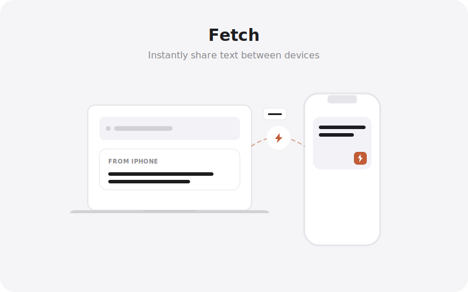

<div align="center">
  
</div>

> Fetch is a shared clipboard. Copy on your phone, it appears instantly on your laptop.

[](LICENSE) [](CONTRIBUTING.md)

---

## How It Works

```
paste text → Firestore write → snapshot fires → other devices receive clip
```

Every device logged in under the same account subscribes to a real-time Firestore stream. No polling. No refresh.

## Architecture

```
Browser / PWA
  └─ Firebase Auth     (user identity)
  └─ Firestore         (real-time clip stream)
       └─ onSnapshot   (live updates across devices)
```

## Data Model

```
clips/{clipId}
  content      string
  contentHtml  string?   (rich formatting preserved silently — not shown in UI)
  device       string
  createdAt    timestamp
  userId       string
```

## Features

- Instant cross-device text sharing
- Real-time updates via Firestore `onSnapshot` — no refresh needed
- **Rich-text formatting preserved** on copy/paste (stored silently, restored on paste)
- Tap anywhere on a clip to copy
- Clipboard suggestion on app focus
- Drag & drop text to save instantly
- Searchable history
- Local cache for instant startup
- PWA — installs on Android, iOS, and desktop

---

## Getting Started

### Prerequisites

- Node.js 18+
- A Firebase project with **Firestore** and **Email/Password Auth** enabled

### Install

```bash
git clone https://github.com/sandip-pathe/fetch.git
cd fetch
npm install
```

### Configure

```bash
cp .env.example .env
# fill in your Firebase credentials
```

### Run

```bash
npm run dev
```

---

## Firebase Firestore Rules

```js
rules_version = '2';
service cloud.firestore {
  match /databases/{database}/documents {
    match /clips/{clipId} {
      allow read, update, delete: if request.auth != null
                                  && request.auth.uid == resource.data.userId;
      allow create: if request.auth != null
                    && request.auth.uid == request.resource.data.userId;
    }
  }
}
```

---

## PWA Install

| Platform | How |
|---|---|
| **Android Chrome** | Address bar → "Add to Home Screen" |
| **iOS Safari** | Share button → "Add to Home Screen" |
| **Desktop Chrome / Edge** | Address bar install icon |

---

## Tech Stack

| Layer | Choice |
|---|---|
| UI | React 19 + Vite 6 |
| Language | TypeScript |
| Styling | Tailwind CSS v4 |
| Auth + DB | Firebase 12 |
| Animation | Motion (Framer) |
| Icons | Lucide React |

---

## Contributing

See [CONTRIBUTING.md](CONTRIBUTING.md).

## Security

See [SECURITY.md](SECURITY.md).

## License

[MIT](LICENSE) © Sandip Pathe
